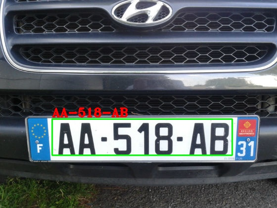

# OCR
Scene text detection and recognition:
  
  Using EAST Technique to detect text in the wild and Tesseract to recognize text.
  1. In order to recognize text form image first we have to install Tesseract Binary for windows.
  2. For better result use Tesseract Version 4.
  
  https://github.com/tesseract-ocr/tesseract/wiki/Downloads
  
  I used east text detector for text detection.
 
 # Some Testing Images:
 
 
 
 
 
 
